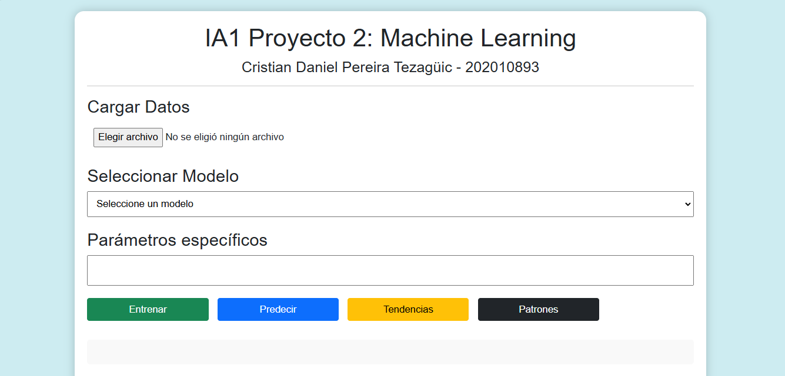
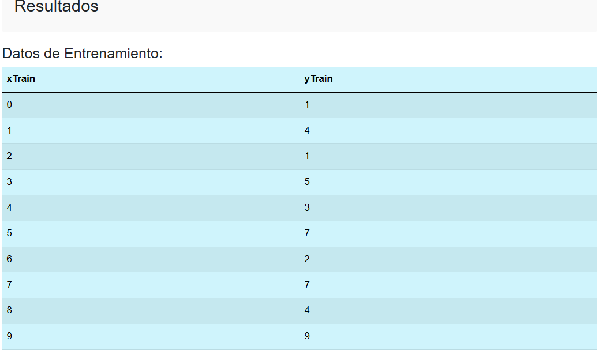
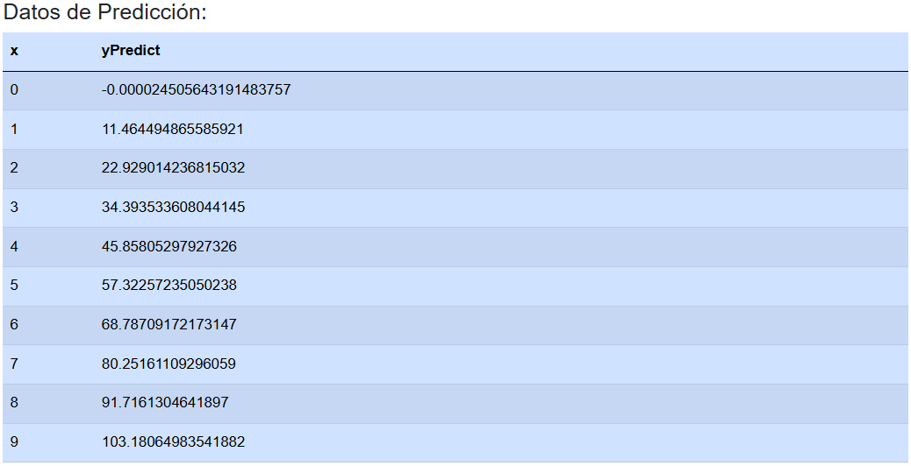

# Manual de Usuario

## Introducción
Este manual de usuario está diseñado para ayudarte a entender y utilizar el sitio web de Machine Learning creado con `tytus.js`. Este sitio permite cargar datasets, seleccionar algoritmos de aprendizaje automático, configurar parámetros y realizar operaciones de entrenamiento y predicción.

## Objetivo
Este sitio web tiene como objetivo practicar los conceptos de Machine Learning mediante el uso de la biblioteca `tytus.js`.

## Requisitos
- Navegador web actualizado.
- Archivo de entrada en formato CSV con los datos.

## Funcionalidades del sitio web
A continuación, se describen las principales funcionalidades disponibles en el sitio.

### Selección de archivos de entrada
- Permite cargar archivos en formato CSV o datasets.
  
### Selección de algoritmos
- Lista los algoritmos de Machine Learning disponibles, permitiendo seleccionar el que deseas aplicar al dataset cargado.

### Parametrización
- Configura los siguientes parámetros antes de ejecutar el modelo:
  - **Argumentos del Modelo**: Configuración adicional según el modelo seleccionado.

### Operaciones disponibles
- **Entrenamiento**: Entrena el modelo con los datos de entrada.
- **Predicción**: Realiza predicciones basadas en los datos y el modelo entrenado.
- **Mostrar Tendencias**: Visualiza gráficos para el análisis de tendencias.
- **Mostrar Patrones**: Visualiza gráficos para el análisis de patrones.

## Uso del sitio web

1. **Cargar archivo**: Haz clic en el botón de carga y selecciona tu archivo CSV.
2. **Seleccionar modelo**: Elige el modelo de Machine Learning que deseas utilizar.
3. **Configurar parámetros**: Completa los campos según tus necesidades.
4. **Ejecutar operaciones**: Utiliza los botones de `Entrenamiento`, `Predicción` `Tendencias` o `Patrones` según la operación que quieras realizar.

### Ejemplo de resultados

#### Entrenamiento

#### Predicción
  
  